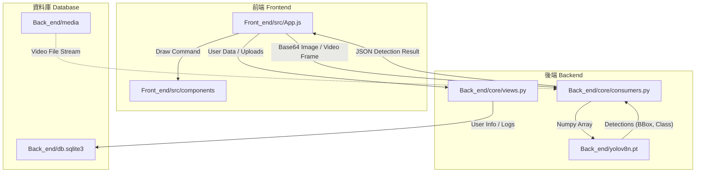

# AI Vision Pro - Real-time Object Detection System


## 📖 專案介紹 (Introduction)

**AI Vision Pro** 是一個高效能的全端即時影像辨識系統，結合了 **Django** 的後端穩定性與 **React** 的前端互動性。本專案利用 **WebSockets (Django Channels)** 實現低延遲的影像串流傳輸，並整合 **Ultralytics YOLOv8** 模型進行毫秒級的物件偵測。

系統設計採用現代化的 Cyberpunk 風格介面，不僅提供即時攝像頭監控與影片檔案分析，還具備完整的使用者認證系統與歷史紀錄管理功能，適用於安全監控、人流統計或自動化檢測等多種場景。

---

## 🏗️ 系統架構與流程 (Architecture & Flowchart)

本專案採用前後端分離架構，透過 WebSocket 建立全雙工通訊通道，實現即時影像處理。

### 資料處理流程圖


### 技術堆疊 (Tech Stack)

* **Frontend**: React.js, HTML5 Canvas, WebSocket API, CSS Modules (Glassmorphism UI).
* **Backend**: Django, Django REST Framework, Django Channels (Daphne/Redis).
* **AI Core**: Ultralytics YOLOv8, OpenCV, NumPy.
* **Database**: SQLite (Default) / PostgreSQL (Production ready).
* **Containerization**: Docker & Docker Compose.

---

## ⚡ 核心功能 (Features)

### 1. 即時 AI 辨識 (Real-time Detection)
* **低延遲串流**：透過 WebSocket 傳輸影像幀，無需頻繁建立 HTTP 連接。
* **YOLOv8 整合**：支援多物件偵測，回傳座標 (Bounding Box)、類別 (Label) 與信心分數 (Confidence)。
* **視覺化繪圖**：前端利用 Canvas API 將偵測框精準疊加於原始影片上。

### 2. 雙模式分析 (Analysis Modes)
* **實時監測站 (Live Mode)**：直接調用本機攝像頭 (Webcam) 進行即時環境分析。
* **影片分析室 (Upload Mode)**：支援上傳 MP4/AVI 等格式影片，後端自動同步檔案並進行回放分析。

### 3. 智慧數據統計 (Smart Statistics)
* **即時儀表板**：動態顯示畫面中各類物件的「目前數量」與「歷史最大數量」。
* **過濾功能**：支援「指定目標模式 (Single Mode)」，可從下拉選單選擇特定物件（如 Person, Car）進行專注追蹤。

### 4. 完整會員系統 (User Authentication)
* **安全驗證**：支援註冊、登入、登出功能，密碼經過 Hash 加密處理。
* **個人管理**：包含個人資料修改 (Profile Update) 與帳號刪除 (Delete Account) 功能。
* **權限控制**：未登入使用者無法存取分析儀表板。

### 5. 檔案與歷史管理 (File Management)
* **自動同步 (Auto Sync)**：後端自動掃描 `media` 資料夾，將手動放入的檔案同步至資料庫。
* **歷史紀錄**：可查看過往上傳影片，並支援一鍵刪除檔案與紀錄。

---

## 📸 成果展示 (Demo)

*(在此處插入您的專案截圖)*

|                                **登入/註冊介面**                                 |                              **AI 分析儀表板 (深色模式)**                              |
| :------------------------------------------------------------------------------: | :------------------------------------------------------------------------------------: |
|  |  |
|                             *具有流體背景的登入頁面*                             |                        *包含即時影像、偵測框與統計表格的主畫面*                        |

|                                 **即時物件偵測**                                  |                               **個人資料管理**                                |
| :-------------------------------------------------------------------------------: | :---------------------------------------------------------------------------: |
|  |  |
|                               *YOLOv8 精準標示物件*                               |                             *修改密碼與用戶資訊*                              |

---

## 🚀 快速開始 (Quick Start)

### 環境需求
* Python 3.9+
* Node.js 16+
* Docker (選用)

### 1. 後端設定 (Backend)

```bash
# Clone 專案
git clone [https://github.com/your-repo/ai-vision-pro.git](https://github.com/your-repo/ai-vision-pro.git)
cd Back_end

# 建立虛擬環境 (macOS/Linux)
python3 -m venv venv
source venv/bin/activate

# 建立虛擬環境 (Windows)
# python -m venv venv
# .\venv\Scripts\activate

# 安裝依賴
pip install -r requirements.txt
# 確保包含: django, channels, daphne, ultralytics, opencv-python

# 資料庫遷移
python manage.py makemigrations
python manage.py migrate

# 啟動後端伺服器 (包含 WebSocket 支援)
python manage.py runserver